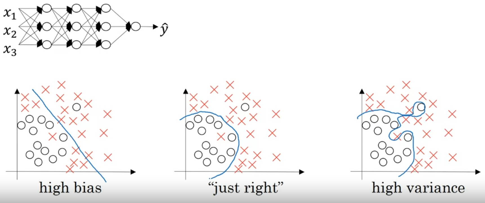

[toc]

# Regularization($L_2$ regularization)
**Goal: Pernalize the weights being too large.**
## Logistic regression as an example
$$\min\limits_{w,b}J(w,b)$$
$J(w,b)=\frac{1}{m}\Sigma^{m}_{i=1}L({\hat y}^{(i)},y^{(i)})$
>**J**:Cost function  **L**:Loss function

$J(w,b)=\frac{1}{m}\Sigma^{m}_{i=1}L({\hat y}^{(i)},y^{(i)})+\frac{\lambda}{2m}\parallel w\parallel_{2}^{2}$
>$\frac{\lambda}{2m}\parallel w\parallel_{2}^{2}$: 正则项, $L_2$ regularization

>$\lambda$:Regularization

## How about neural network?
$$\min_{w^{[1]},b^{[1]},\dots,w^{[L]},b^{[L]}}J(w^{[1]},b^{[1]},\cdots,w^{[L]},b^{[L]})$$
$J(w^{[1]},b^{[1]},\cdots,w^{[L]},b^{[L]})=\frac{1}{m}\Sigma^{m}_{i=1}L({\hat y}^{(i)},y^{(i)})+\frac{\lambda}{2m}\Sigma^{L}_{l=1}\parallel w^{[l]}\parallel_{F}^{2}$
>$\parallel w^{[l]}\parallel_{F}^{2}$:Frobenius norm (actually equals to 2-norm)

>$L_2$ regularization is also called "weight decay"

# How does regularization prevent overfitting?


## An intuition
If you let $\lambda$ very high, one piece of intuition is maybe it'll set the weight($w^{[l]}$) to be so close to zero for a lot of hidden units that's basically zeroing out a lot of the impact of these hidden units.  
（许多神经元的影响被变得很低，所以神经网络的规模变小了，所以high variance(overfitting)->high bias(underfitting)）

## Another intuition


如果$\lambda$变大，$w^{[L]}$变小，所以$z^{[l]}$就会变小（此处先忽略$b^{[l]}$的影响），所以如果activation function是$\tanh$的话，其就会变得相对线性（如图所示），即变得相对比较简单，因此就不太会overfitting

# Regularization(dropout regularization)


对于一个hidden layer，把每个神经元以一定的概率（随机的）丢弃

## Implementing dropout("Inverted dropout technique")
```python
#Illustrate with layer l = 3
keep_prob = 0.8
d3 = np.random.rand(a3.shape[0],a3.shape[1]) < keep_prob #d3 is the dropout vector of the layer 3(a bool matrix in python)
#Which means there's a 0.2 chanse of eliminating any hidden unit
a3 = np.multiply(a3,d3)  #also: a3 *= d3
a3 /= keep_prob #very important
```
>**最后一步**的原因：因为$z^{[4]}=w^{[4]}a^{[3]}+b^{[4]}$，而有一部分unit失活了，这意味着$a^{[3]}$中20%的元素都被清零了，所以为了不减少$z^{[4]}$的期望值，我们把$a^{[3]}$除以0.8，这样$a^{[3]}$的期望值就不会改变（此处照样忽略$b^{[4]}$的影响）

>**最后一步**还简化了神经网络的test部分，因为它减少了可能引入的缩放问题

## Making predictions at test time
>**No dropout at test time!**

# Understanding dropout
## Why does dropout work?


**Intuition:** Can't rely on any one feature, so have to spread out weights.（即不让这个神经元完全依赖于前一层的任何一个神经元，不愿意把所有的赌注都押在一个输入上，所以让每个输入的神经元都随机消失）  
**Tips:** 你可以为不同的hidden layer选择不同的keep_prob，这取决于你觉得这一层overfitting的程度（相对于其它层）  
**Summary**：如果你更担心某些层会overfitting（相对于其它层），你可以为某些层设置较低的keep_prob。缺点是，这会让你使用cross validation搜索更多的hyper parameter。  
**One big downside of dropout:** The cost function $J$ is no longer whell defined on every iteration. So it will be harder to double check the performance of gradient descent.
>所以, 刚开始绘制$J$随迭代次数下降的图表的时候，让keep_prob = 1，训练一遍，来看是否$J$真的在一步步下降

# Other regularization methods
## Data augmentaion
eg.在Image Classification里，你可以将图片水平翻转，让数据量翻倍（或者随意裁剪blabla...）
## Early stopping
在gradient descent时，画一个training error（or cost function）的曲线，再画一个dev set error的曲线。


当你刚开始在神经网络上迭代时，你的参数w会接近于0，因为通过随机初始化(random initialization)，很可能你给w的初始值是一个较小值，因此在训练足够长时间前，w仍然很小，然后随着你继续迭代训练，w越来越大，直到这里，可能你的神经网络就有一个很大的参数w了。所以early stopping做的是：通过停在半路，你能得到一个不大不小的w值。

Orthogonalization:
* Optimize cost function $J$:
   * Gradien descent, Momentum,RMSProp, Adam......
* Not overfitting:
   * Regularization, more data......
> Early stopping 不需要像$L_2$ regularization一样尝试不同的$\lambda$值，而达到同样的效果。但是，它有一个**缺陷**，它把orthogonalization的两个步骤结合起来了，这使得分析问题变得更加复杂。  
