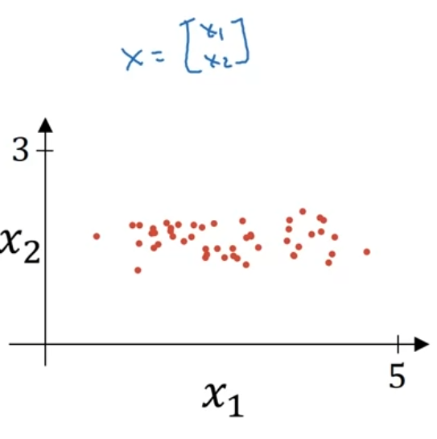

[toc]

# Normalizing inputs
## Normalizing training sets


1. Subtract out the mean
   * $\mu=\frac{1}{m}\Sigma^{m}_{i=1}x^{(i)}$
   * $x=x-\mu$


2. Normalize the variance
   * $\sigma^{2}=\frac{1}{m}\Sigma^{m}_{i=1}{(x^{(i)})}^{2}$
   * $x/=\sigma$
  
经过这两步之后，$x_1$和$x_2$的分布都变成$[-1,1]$了。  

## Why normalize inputs?


如图所示，normalize可以让你的gradient descent的过程更平滑（或者说更容易）
**不管怎么样，总是normalize inputs总是没错的！**

# Vanishing/exploding gradients
当训练神经网络时我们会遇到一个问题，尤其是当训练层数非常多的神经网络时，这个问题就是梯度的消失和爆炸，它的意思是当你在训练一个深度神经网络的时候，cost function的导数或者说斜率，有时会变得非常大，或者非常小甚至是呈指数级减小，这使训练变得很困难。

假设一个神经网络如图所示：
  

假设我们所用的activation function是$g(z)=z$，并且每一层的权重矩阵$w^{[l]}$都是$\begin{bmatrix}1.5 & 0 \\0 & 1.5\end{bmatrix}$,那么最后$\^y$就会变得非常大（$1.5^{L-1}x$），相反如果$w^{[l]}$都是$\begin{bmatrix}0.5 & 0 \\0 & 0.5\end{bmatrix}$，那么最后$\^y$就会变得非常小。  
在非常深的神经网络里，如果权重系数（或矩阵）$w$只比1（或单位矩阵）大一点点或者小一点点，那么activation function就会爆炸或者消失（即随着$L$指数级地增加或减少）。同样的论证可以得出：计算机算出的倒数（或梯度）也会指数级增加或减少。

# Weight initialization for deep networks
## Single neuron example


在这个网络里，$z=w_1x_1+w_2x_2+\ldots+w_nx_n$  
很容易看出，larger $n$ -> smaller $w_i$  
所以我们让$w$这样初始化（使用RELU激活函数）：
使用$\sqrt{\frac{2}{n^{[l-1]}}}$放缩来初始化$w$
```python
w[l]=np.random.randn(shape[0],shape[1])*np.sqrt(2/n[l-1])
```
这种初始化$w$的方法可以一定程度上解决vanishing/expoding gradients的问题。因为这种做法通过设置权重矩阵$w$，使得$w$不会比1大很多，也不会比1小很多，因此梯度不会过快地膨胀或者消失
## Other variants
tanh: 使用$\sqrt{\frac{1}{n^{[l-1]}}}$放缩来初始化$w$ （Xavier initialization）  
>这个放缩系数也是一个hyper parameter，可以自己调整  
# Numerical Approximation of Gradients
一些微积分基础，略  
# Gradient Checking
  

**Question: Is $d\theta$ the gradient of $J(\theta)$?**
for each i:
$$d\theta_{approx}^{[i]}=\frac{J(\theta_1,\theta_2,\ldots,\theta_{i+\epsilon},\ldots)-J(\theta_1,\theta_2,\ldots,\theta_{i-\epsilon},\ldots)}{2\epsilon}\\
\approx d\theta_{[i]}=\frac{\partial J}{\partial \theta_i}$$  
We need to check $d\theta_{approx}\approx d\theta$ ?  
通过两个向量的Euclidean distance(normalize后的)判断：  
$$\frac{||d\theta_{approx}- d\theta||_2}{||d\theta_{approx}||_2+||d\theta||_2}$$  
如果$\frac{||d\theta_{approx}- d\theta||_2}{||d\theta_{approx}||_2+||d\theta||_2}\le\epsilon$ （$\epsilon$一般取$10^{-7}$），那就说明你的微分近似是对的(great!)。  
如果在$10^{-5}$左右，那就可能有点问题了，需要检查几遍。  
如果在$10^{-3}$左右，那就要慎重检查，很大可能有错误。  
# Gradient Checking implementation notes
* Don't use grad-check in training - only to debug.    
（如果训练时候使用，会使训练十分缓慢）
* If an algorithm fails grad check, look at the components to try to identify bug.  
（检查不同的$i$，看哪些$d\theta^{[i]}$和$d\theta_{approx}^{[i]}$差距过大）
* Remember regularization.
* Grad-check doesn't work with dropout.  
(let keep_prob = 1 when you grad-check)
* Run at random initialization; perhaps again after some training  
（虽然很少发生，但并不是没有可能，你对于梯度下降的使用是正确的。同时w和b在随机初始化的时候，是很接近0的数，但随着梯度下降的进行，w和b有所增大。也许你的反向传播算法在w和b接近0的时候是正确的，但是当w和b变大的时候是错误的。所以虽然不会经常使用它，但是你可以尝试的一个方法是：在随机初始化的时候，运行梯度检验，然后训练网络一段时间，那么w和b将会在0附近摇摆一段时间，即刚开始w和b的随机初始值很小。在进行几次训练的迭代后（这时w和b变大了）再运行梯度检验）