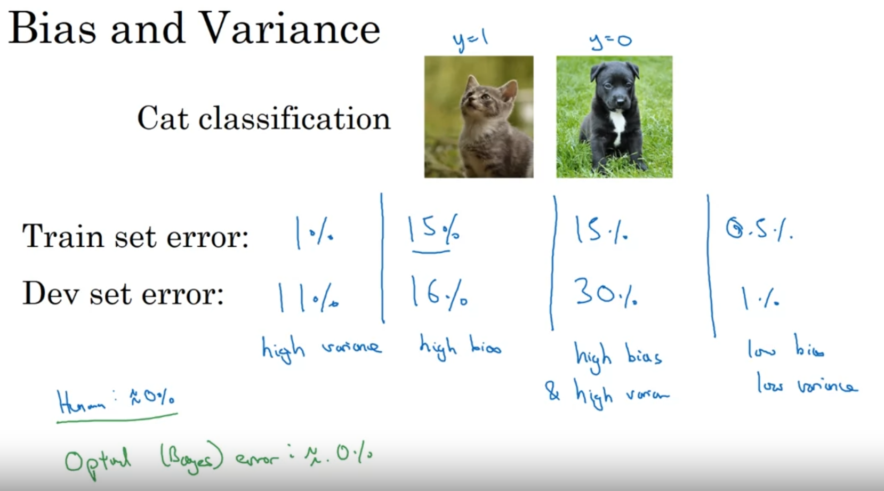
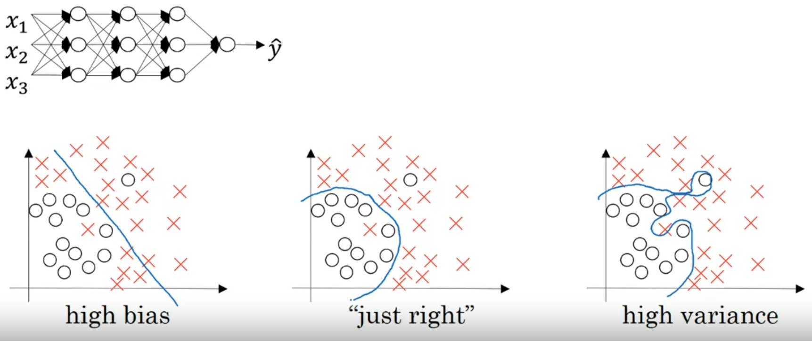

[toc]

# Train/dev/test sets
**Training set:**  
训练model  
**Hold-out cross validation set(also development set)(dev set):**   
看哪个model效果最好  
**Test set:**  
评估最佳model的算法性能  

>If you have 1million datas.The ratio of the 3 sets should be 98/1/1%

# Bias/Variance
  

(1)Underfitting (2)just right (3)overfitting

# Basic Recipe for Machine Learning
1. **High bias?(trainning set performance)**  
* Yes:  
   * Bigger network
   * Training longer
   * NN architecture search
* No: Continue  
2. **High variance?(dev set performance)**  
* Yes:
   * More data
   * Regularization
   * NN architecture search
* No: Done